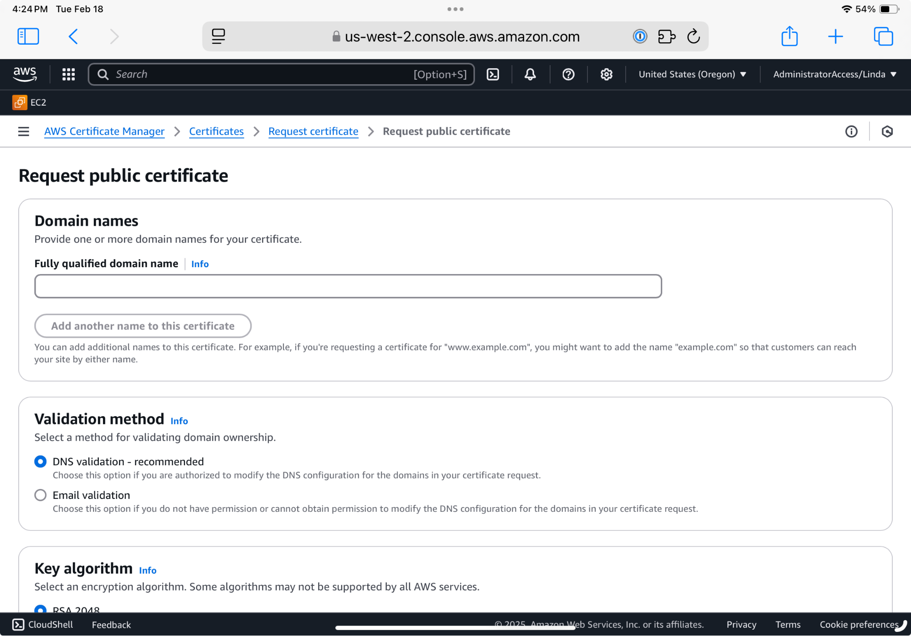
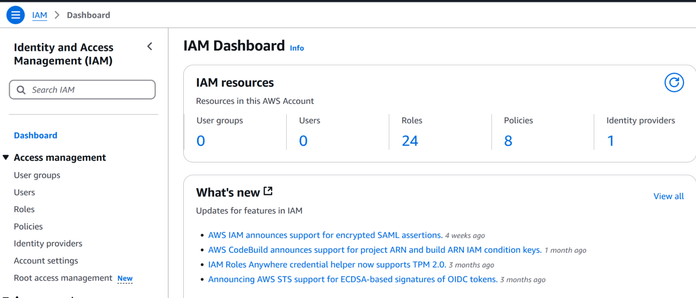
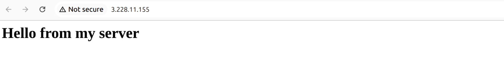
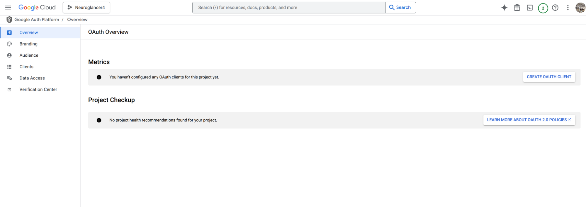
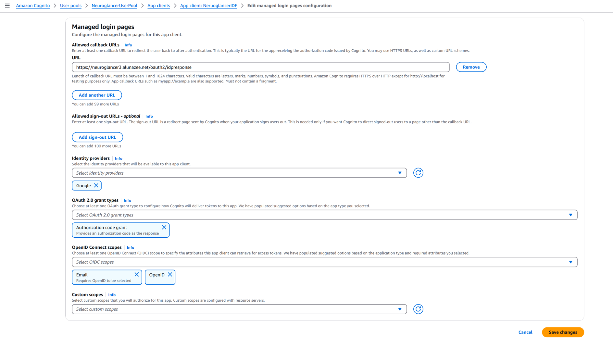
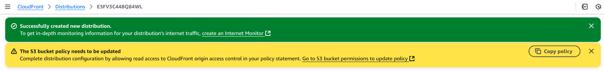
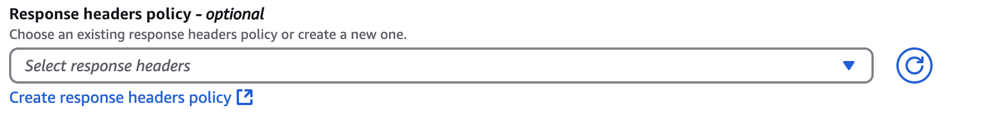
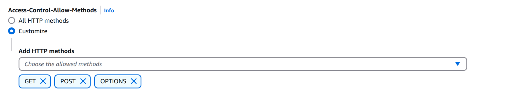

# Documentation for the set up of a Private Neuroglancer Server

# Step 1: Select an AWS domain and create an AWS certificate

## Identify an AWS domain with Route 53

If one is not already available, select an AWS domain. This documentation describes how to set up Neuroglancer with a domain that was registered in the AWS account where the Neuroglancer instance is being deployed.

A domain is found and registered from the main AWS Route 53 dashboard:  

## Request a certificate for the domain

Once a domain is registered it is hosted automatically. Double check that it is hosted by clicking on Hosted zones near the top of the left hand listing.

Request a certificate using AWS Certificate Manager service. Add the selected domain name to the “Fully qualified domain name” box such as:  
domainname.com

Then click the “Add another name to the certificate” button and add:  
\*.domainname.com

Keep the defaults and click “request” near the bottom right. 

# 

Once a certificate is requested, navigate to ACM, click on the name of the certificate you just created. On the next screen click the button on the top right called “Create records in Route 53”. Make sure the domain names for the requested certificate are checked and click the “Create record” button on the bottom left. 

**This can take up to 30 minutes**, wait for it or the error message if it can not provide the certificate.

# Step 2: Create security groups

Create the following security groups from the EC2 dashboard in a known VPC. The default VPC is fine but not necessary if the same VPC is used throughout. For these instructions, the VPC is public facing. Note the target region for this VPC and use this region throughout this document.

Caveat: this was tested in us-east-1. It is possible that there are small differences when using other regions. Placing the Neuroglancer Instance close to the S3 bucket will offer an advantage.

Please note that these security groups require  modification of only the inbound rules. During the creation of the security groups, please double check that only the inbound traffic is being modified. The current security group console seems to encourage the error of modifying the outbound rules instead of the inbound rules.

It is a best practice not to use ssh. RSA is known to be potentially compromised. The ssh security group is optional but not recommended for use here. The better alternative is to use an IAM role with SSM attached to the EC2 instance and to then connect to the instance through SSM. An IAM role is created in the next step to allow this. 

Create the following security groups:

1. http from all sources  
2. https only, from all sources  
3. app security group, all traffic between apps using the security group id  
4. SUBOPTIMAL: SSH only, from a localized ip address 

   \-(please do not open to the world)

The app security group is a two step process and described below the table.

| Name | traffic | source |
| :---- | :---- | :---- |
| http | http (80) | 0.0.0.0/0 |
| https | https (443) | 0.0.0.0/0 |
| app | all | the security group id |
| ssh | ssh (port 22\) | Only local to developer |

Creating the “app” security group requires creating a security group called “app”, adding a description such as “alb to ec2 communication”, and saving it with no modifications to the incoming or outgoing traffic. After it is saved, select it again to edit the inbound rules and add a new rule. For this rule, select “All traffic” for the type, click on the box with the magnifying glass, search the security group id itself and save the rules. By scrolling down in the search box the security group with the name “app” will be shown and can be selected. When the ALB is connected to an EC2 instance and both have this security group attached then all traffic is allowed between them or to any other infrastructure using the “app” security group.

# Step 3: Create an IAM role to allow access to an EC2 instance via SSM

A terminal window for an EC2 instance can be accessed from the EC2 dashboard using AWS Systems Manager if the EC2 instance has an IAM role attached to it that gives Systems Manager permission to do so. This allows access to the instance without port 22 allowing that port to remain closed. 

## Create an IAM role for SSM access to EC2 

Move to the IAM console to create an IAM Role. Select role from the left hand menu bar and click the orange “create role” button on the upper right.

Go to the IAM Console

Select EC2 as the trusted entity and select the orange next button at the lower right.

Attach the policy AmazonSSMManagedInstanceCore by entering the word “core” into the search bar and selecting “AmazonSSMManagedInstanceCore” followed by the orange next button in the lower right corner. Give the role a name: “SSMforEC2” and click the orange “create” button on the lower right. This role will be available when creating the EC2 instance in the next step.

This works because amazon adds an SSM-agent to the amazon provided amazon linux and ubuntu AMI’s by default. 

## How to connect to an EC2 instance using SSM

An instance launched with this role attached can be accessed from the EC2 console using the connect button in the upper right corner.

There are multiple ways to connect using the connect button. Pick the middle option, “Session Manager” and then the orange “connect” button.  

This logs you into a terminal window but as a user called “ssm-user”. 

If on an ubuntu instance, login using “sudo su \- ubuntu”.  on an amazon linux instance, login as “sudo su \- ec2-user”. The session has a 20 minute idle timeout after which the window is terminated.

# Step 4: Create the Neuroglancer web server 

Double check you are in the region you want to be in.

An Ubuntu EC2 instance is created to begin the creation of the cognito / alb infrastructure. The neuroglancer code is added later. 

Go to the EC2 dashboard and launch an “ubuntu” instance. Name it “Neuroglancer” or something similar. Use a c6a.large instance. Use the security group with port 80 open (Allow HTTP traffic from the internet) and the “app” security group. Set the keypair if desired but it is not necessary. Select 24G of volume space. 

Open the advanced menu and with the IAM instance profile role, add the IAM role just created from the advanced menu.  

Use the advanced settings to boot up with the following user data. All other settings can be left at their defaults.

**Caution,** google docs sometimes changes the double quotes in the last line to “smart quotes” which causes the script to fail. Paste as unformatted text if possible. Please double check the quotes after pasting into the User Data box.

\#\!/bin/bash  
apt update \-y  
apt install nginx \-y

cat \<\< EOF \>\> /etc/nginx/sites-available/default  
server {  
    listen 80;  
    server\_name \_;  \# Accepts requests to any IP or domain

    root /var/www/html;  
    index index.html;

    location / {  
        try\_files $uri $uri/ \=404;  
    }  
}  
EOF

mkdir \-p /var/www/html  
echo "\<h1\>Hello from my server\</h1\>" \> /var/www/html/index.html  
chown \-R www-data:www-data /var/www/html  
chmod \-R 755 /var/www/html

systemctl restart nginx  
systemctl enable nginx  

Launch the instance. Ignore the warning about the need to proceed without selecting a key pair if one is not available. Give the EC2 instance 10 minutes to come up.

Check that this instance is a webserver by copying the ip address from the AWS console EC2 instance details and then pasting the ip address in the browser. Paste the IP address without http or https initially. If this does not work, add http:// to the ip address. 

Https will not work but some browsers may redirect to http to allow the website to come up. The page does not have a certificate attached and the response to the requested URL is different with different browsers. Use the IP address and not the DNS name. The page should look something like this:

Step 5: Create target group

As always, double check the region (last time mentioning this). 

The next steps bounce back and forth between the AWS Cognito, ALB, GCP, and Route 53 services as we update each with setup information created along the way.

From the EC2 dashboard select “Target Groups” located in the lower portion of the left hand column. Select the orange “Create target group” button. Leave the default selection of “Instances”, scroll down, give the target group a name such as “NeuroglancerTarget”. Keep the defaults as is and click the orange next button at the lower right. 

Select the instance just created from the upper portion of the page. The port should still be 80\. **Select the button in the middle of the page “Include as pending below”. This step is easy to miss.**

Select the orange “Create target group” near the bottom of the page. 

# Step 6: Create the Application Load Balancer (ALB)

From the EC2 dashboard select “Load balancers” on the lower left hand side. Select the orange “Create load balancer” button. Select the first box “application load balancer” by clicking the blue button “Create”. Give the ALB a name such as “NeuroglancerLoadBalancer”. Keep the defaults. Select all of the subnets available. Next for security groups, remove the default security group if offered, add the security groups with port 80,  port 443, and the app security group.

Keep the default listener on port 80 and point it to the target group created in the previous step. Keep the other defaults and press the orange “Create load balancer” at the bottom of the page.  

Going back to the load balancer dashboard will show that the state is “Active” when the load balancer is ready. It can take a few minutes so go get another cup of coffee.

The ALB has a DNS name such as: NeuroglancerLoadBalancer-366218461.us-east-1.elb.amazonaws.com Make a note of this though I don’t think this is used later.  

Paste it into a browser window (with http:// added) and you should receive the same result as in the previous step. 

# Step 7: Create Cognito User Pool

The cogito user console is potentially different depending on the users’ account because of the recent roll out. If you don’t see a console that appears like the one in these instructions, please let me know. 

Go to the AWS Cognito service. Click the orange “Create user pool” button on the upper right. If this is not immediately visible, click “user pool” from the left column first. Double check that you are selecting “user” pool NOT selecting “identity” pool.

At the set up page keep the default “Traditional web application”. You can try and change the name of the application but I find it usually doesn’t take and it is easier to rename the user pool later. Click “email” for sign up. If other attributes are desired for sign up, then they must be clicked at this time (or cognito will need to be recreated which is easy enough). 

Note the existence of the “return URL” entry but leave it empty for now. Click on the yellow “Create user directory” in the lower right hand corner.

Go back to the amazon cognito dashboard and click on “user pools”. Click on the obscure name of the user pool just created. Click on “rename” in the upper right corner and give the user pool a better name. Rename the name of the user pool to something like “NeuroglancerUserPool”.  

Click on “Domain” in the lower left hand column. Copy the cognito domain URL: [https://us-east-1fgg4vnmhs.auth.us-east-1.amazoncognito.com](https://us-east-1fgg4vnmhs.auth.us-east-1.amazoncognito.com) to a known holding spot. This will be needed when setting up the google identity in the next step.

# Step 8: Create GCP, Google Identity Federation

Using the email associated with the workspace you are using, go to the GCP dashboard at [https://cloud.google.com/](https://cloud.google.com/) Login with your email. Double check that you were logged into the email you are targeting as GCP will take the account from your browser. You can use a generic gmail email but the “internal” user option may not be available as there is no workspace.

The first time someone logs into the workspace there could be terms and conditions that have to be agreed to. It is also possible that another workspace users have worked with the GCP console.  
   
It is important to note that while AWS is account focused, GCP is project focused with many projects in one account or workspace. You will want to work in your own project. But first, after logging into GCP, check the GCP dashboard for any signs of current activity as indicated by customized names or the existence of non-default project. 

This is most obvious by looking at the box just to the right of the words “Google Cloud” in the upper left hand corner. Clicking on that box will show you a list of projects available. Start by making a new project to use for the google identity.

To do so, click on the box next to the google cloud logo and a pop up will appear with an option to make a new project (see picture). Click on “New project” and create a new project. Call it something like NeuroglancerIDF. Use the defaults for everything else (or pick judiciously if necessary).

Always double check you are in the correct project while using GCP. Occasionally you might bounce into other projects or even recently deleted projects. If there is a need to start from scratch, delete the old project and make a new project.

If you are not automatically placed into the new project, select the box to the right of “Google Cloud” and pick the project just created. This should isolate you from other activity within the GCP account. 

Once in the new project, click on the burger menu to the left of the “Google Cloud” logo and select “APIs and Services” \-\> “Credentials”. It looks like this:  

Notice the “CONFIGURE CONSENT SCREEN” button on the upper right and then click on it. Then click on “get started”. 

Provide an App Name such as NeuroglancerAPP. Use the pull down menu to select your email address. Click Next and then click “Internal”. Click next. Enter your email and click “next” again. Agree to terms, click continue and create. The screen will look like this:  

If it doesn’t, go back to the credentials dashboard: Click on the burger to the left of the “Google Cloud” logo and click on APIs & Services \-\> Credentials.

Click on the “CONFIGURE CONSENT SCREEN” button again.  

Select the “branding” menu item on the left in the picture below.  

After clicking on “branding”. Add amazoncognito.com as an “authorized domain” near the bottom of the screen and click the blue SAVE at the very bottom. 

Select the ”data access” menu on the left.

Click on “ADD or REMOVE SCOPES”. Select the first three and save. These are:

…/auth/userinfo.email  
…/auth/userinfo.profile  
openid

and click the blue update button and then the blue SAVE button.

These menus can be found here if needed again:  
Go back to the credentials dashboard: Click on the burger to the left of the “Google Cloud” logo and click on APIs & Services \-\> Oauth consent screen.

Go back to the credentials dashboard: Click on the burger to the left of the “Google Cloud” logo and click on APIs & Services \-\> Credentials.

If you see the “CONFIGURE CONSENT SCREEN” button again, click on it and step through all the menu items on the left hand side to double check that these pages are filled out as above.

Again, go back to the credentials dashboard: Click on the burger to the left of the “Google Cloud” logo and click on APIs & Services \-\> Credentials.

If you see the “CONFIGURE CONSENT SCREEN” button again, kill all of the google tabs and step away for five minutes. This happened to me repeatedly and I don’t know why. I think it's a browser cache issue or bug.

Login again, double check you are in the correct project, click on the burger to the left of the “Google Cloud” logo and click on APIs & Services \-\> Credentials. The "CONFIGURE CONSENT SCREEN” button should be gone:  

Click “+Create Credentials” near the center upper dashboard. Select “OAUTH client ID” from the revealed pulldown menu. 

Select Web application in the pull down box, add a name such as NeuroglancerWEB. Add the URL from “Step 7: Create Cognito User Pool” to the authorized javascript origin. It looks like this:  
[https://us-east-1fgg4vnmhs.auth.us-east-1.amazoncognito.com](https://us-east-1fgg4vnmhs.auth.us-east-1.amazoncognito.com)  

Add the authorized redirect as, below that (not visible in the picture):  
https://us-east-1fgg4vnmhs.auth.us-east-1.amazoncognito.com/oauth2/idpresponse

Click create.

Copy the client ID (yours will be different) to a known location.  
573222911176-bgtja564jv2cklk4u9qbkqsh41bsq543.apps.googleusercontent.com

Copy the client secret.  
GOCSPX-MNQz2w5I4OKrsC5kppsPdr\_NGbpC

Download the json.

Click “OK”.

Take a break before the next step to allow GCP to assimilate the information.

# Step 9: Modify the cognito user pool with the GCP information

Go back to AWS Cognito, click on “User Pools” on the right, and select your user pool by clicking on the name. Click on the blue “Manage Providers” which is found way down in the lower right. Select “Add Identity Provider” on the upper right. 

Select “google” and add client ID and client secret.  
Add the words “profile email openid” for Authorized scopes.  
Map the email attribute as shown in the picture.  
Select “Add Identity Provider”

From the cognito dashboard \-\> User Pools \-\> click on the created app name \-\> App Clients \-\> click on the blue app client name \-\> click on “login pages” \-\> Click on edit for the “Managed login pages configuration”.

Make the following changes: 

- Change the identity provider to google only  
- Change oauth2 grant type to: Authorization code grant  
- Remove the phone from the open ID scopes

Save the changes.

Click on “Sign-up” from the middle left hand column. Click on “edit” for the self-service signin (near the bottom of the page). Toggle off the ability to self-register.

# Step 10: Add the cognito login to the ALB

The certificate created earlier is required at this step.

Go back to the EC2 page and select ALB from the left hand column. Select the name of the load balancer created earlier. Scroll down to “listeners and rules” and select “Add listener” which is located in the lower right hand corner.

Select https for the protocol and 443 for the port. Toggle the box in the Authentication section to select “Use open id or amazon cognito”. Select “amazon cognito” in the pull down menu for Identity provider. Select the user pool created earlier in the “User pool” pull down menu. Select the app client offered from the pull down menu.  

Leave “Forward to target groups” and select the target group created earlier in the box below.

Select “Turn on group stickiness” and set duration for 7 days.

Leave the next row at their defaults and select the wildcard certificate created earlier from the drop down menu (\*.domainname).

Click on the orange “Add” button on the lower right hand corner.

Select the HTTP:80 listener. Select the “Manage listener” pull down menu and delete the port 80 listener.  

Next, remove the port 80 security group. To do so, click on the “Security” tab in the center of the screen. Click on “edit” on the right, click the small x next to the http group. From the “Security groups” box, add the “app” security group if it is not already there. Click on the orange “Save changes” button.

**From the main EC2 instance console page, remove the port 80 security group from the Neuroglancer Instance.**

Please note that going to the ALB URL will not connect because GCP and cognito do not yet know how to return to the ALB.

# Step 11: Point a friendly URL to the ALB 

Go to Route 53\. Select hosted zones from the upper left menu. Select the domain name created in Step 1\. Select the orange “create record”.  

Add the desired subdomain name such as “neuroglancer”. Select the alias toggle right below the added name. A set of menus will appear. 

In the first new menu, “route traffic”, select “Alias to Application and Classic Load Balancer”. In the next menu box below, pick the region for the location of the ALB. While ALB is a regional service, route 53 is a global service. The next pull down box will offer the ALB name to pick \- there is likely only one to choose from. Select the orange “create record”.

Note the entire domain name such as “neuroglancer.domain.com”.

Wait 10 minutes for it to propagate.

# Step 12: Add the URL to the cognito return 

Return to the cognito dashboard. Double check the region. Leaving a global service typically places you back in us-east-1

From AWS Cognito, click on “User Pools” on the right, and select your user pool by clicking on the name. Click on the “App clients” menu item on the upper left. Select the app client name in blue and select “managed login pages configuration” near the center of the screen. Click “Edit” directly to the left of the “View login page” button and in the middle of the right hand side of the page.  

Add the full domain name to cognito with **oauth2/idpresponse** added to the end as shown in the picture below. It will be something like: [https://neuroglancer.domain.com/oauth2/idpreponse](https://neuroglancer.alunazee.net/oauth2/idpreponse)

Click the orange “save changes” button at the lower right corner. Again, wait 10 minutes.

At this point, you should be able to check the route 53 URL in a browser such as: 

https://neuroglancer.domain.com

A reminder that caching in the browser can make checking and rechecking websites slow to update so change browsers or move into incognito mode if things don’t appear to be working right.

**TEST:** Double check that calling the URL requires logging into the GCP workspace used above. After logging in, the user is automatically redirected to the Neuroglancer instance (which is currently hosting a dummy web page). 

Important: Debug if it is not working by retracing steps (or calling Linda) before proceeding.

# Step 13: Modify the Neuroglancer Instance to host Neuroglancer

In this step we will connect to the Neuroglancer EC2 instance created earlier. Install the Neuroglancer software and create a production version. Nginx is then used to host the production version of neuroglancer.

## Install Neuroglancer

Go to the EC2 dashboard and connect to the instance created earlier using SSM. Switch to the ubuntu user if logged in as ssm-user. 

sudo su \- ubuntu

Step through the following commands from the prompt.

sudo apt-get update \-y  
git clone https://github.com/google/neuroglancer.git  
wget \-qO- https://raw.githubusercontent.com/nvm-sh/nvm/v0.40.1/install.sh | bash  
. \~/.bashrc  
nvm install stable  
cd neuroglancer  
npm i

## Modify the http\_request.ts file and build Neuroglancer

The command to fetch the Neuroglancer input files in the private S3 bucket is modified to allow for the addition of credentials. Two lines are added to the http\_request.ts file. Move to the src directory:

cd /home/ubuntu/neuroglancer/src/util

Using your favorite editor, edit the “http\_request.ts” file.

vi /home/ubuntu/neuroglancer/src/util/http\_request.ts

The following two lines are added right after line 105, “for (let requestAttempt \= 0; ;) {“   
There are four spaces at the front of the line for the correct indentation:

    init \= init || {};  
    init.credentials \= "include"; // Ensure cookies are sent with requests

## Build Neuroglancer

Return to the neuroglancer directory:

cd /home/ubuntu/neuroglancer/

Build Neuroglancer as follows:

npm run build

Host the production version:  
sudo mkdir \-p /var/www/neuroglancer  
sudo cp \-r dist/client/\* /var/www/neuroglancer/  
sudo chown \-R www-data:www-data /var/www/neuroglancer  
sudo chmod \-R 755 /var/www/neuroglancer

Create the following file using the file editor of your choice:

sudo vi /etc/nginx/sites-available/neuroglancer

Copy and paste the following text. 

server {  
    listen 8080;  
    server\_name your-domain.com;  \# Replace with your actual domain   
    root /var/www/neuroglancer;  
    index index.html;

    location / {  
        try\_files $uri /index.html;  
    }  
}

**IMPORTANT:** Replace the URL in the file to the name added to route 53 above as specified with the comment statement at the top of that file. For example, use neuroglancer.domain.com

Enable the new configuration:

sudo ln \-s /etc/nginx/sites-available/neuroglancer /etc/nginx/sites-enabled/  
Remove the link to the default (dummy) website created earlier with the following command. 

sudo rm /etc/nginx/sites-enabled/default

Restart nginx and test the new configuration:  
sudo systemctl restart nginx  
sudo nginx \-t

The output of this command should look like this:  

Neuroglancer should now be running on this instance but is not yet accessible to the ALB.

# Step 14: Update the target group to port 8080

From the EC2 dashboard select “Target Groups” located in the lower portion of the left hand column. Select the blue name of the previously created target group. Select the Neuroglancer instance and click deregister.

Select the blue button “Register targets”. Select the instance and change the port to 8080\. Select “**Include as pending below**” button which is easy to miss.  

Click the orange “register pending targets” in the lower right corner.

**TEST:** The neuroglancer instance is now available with the URL. Please test it  

# Step 15: Check the S3 bucket to be hosted by cloudfront

This step assumes you have already created an S3 bucket with the files added that are required for viewing in Neuroglancer and that the S3 bucket is set up with the defaults of no public access. It is helpful if the bucket is in the same region as the EC2 instance created above.

Please double check this and make private if necessary. “Block all public access” will be enabled or “on”.

Check the bucket for any existing permissions such as a bucket policy and remove it if it exists. If you believe they are necessary then those permissions will need to be integrated with the permissions that follow in later steps. We will add a bucket policy and a cors policy later on and these will be overwritten with the procedures here.

Also note that “static website hosting” should not be enabled as is the default. Once the cloudfront distribution is created, we will add a bucket policy to the bucket allowing it to communicate with cloudfront.  

# Step 16: Create a cloudfront key pair and key group

Cookies are used to authorize the request of private S3 files hosted by a cloudfront distribution. A public and private RSA key pair is used to create that authentication.

## Create a cloudfront key pair 

Connect to the Neuroglancer Instance again using SSM. Move to the \~/.ssh directory. Enter the following three commands to create a private and public key:

openssl genpkey \-algorithm RSA \-out temp.pem \-pkeyopt rsa\_keygen\_bits:2048  
openssl pkey \-in temp.pem \-traditional \-out ngcloud.pem  
openssl rsa \-in ngcloud.pem \-pubout \-out ngcloud.pub

Copy the private key to location used by nginx:

sudo cp \~/.ssh/ngcloud.pem /etc/nginx/ngcloud.pem

Modify the permissions and ownership:

sudo chmod 600 /etc/nginx/ngcloud.pem  
sudo chown root:root /etc/nginx/ngcloud.pem

Keep this SSM window open and navigate to CloudFront console in a different browser tab. In the menu on the left and select “public keys”. Select the orange “create public key” from the upper right hand corner. Give the key the name “ngcloud”.

From the SSM terminal display the public key: ngcloud.pub with the cat command.

cat nglcoud.pub

Copy and paste the contents of that file into the cloudfront page just displayed.

Select the orange “Create public key” in the lower right corner.

## Note down the key ID

Navigate to CloudFront console, in the menu on the left side of the screen find the section called “Key management”, click on the option “Public keys”. Find the name of your key, “ngcloud”, and copy the ID for later use.  

## Create a cloudfront key group

Next, click on ‘Key groups’ menu item on the lower left hand side of the cloudfront console. Select the orange “Create key group” in the upper right hand corner. Enter the name for the key group: “NGcloudKeyGroup”. Select the key just created, “ngcloud”.

Select the orange “Create key group” button on the lower right.

# Step 17: Set up CloudFront to serve S3 bucket

Cloudfront hosts files in the S3 bucket maintaining privacy by requiring a cookie request when the files are fetched by Neuroglancer.

## Create a CloudFront distribution 

Go to the AWS CloudFront console and create a new distribution by selecting the orange “Create Distribution” button. Select your S3 bucket from the drop down menu in the Origin domain box. Leave the ‘Origin path’ field blank, and accept the default for the “Name”. Select “Origin Access Control Settings (recommended)” and select the blue “create a new OAC”.  

At the “create new OAC” panel select the orange “create” button.

A note appears to copy the bucket policy for your s3 bucket but the policy to be used is not shared until the distribution has been created so we will do this later.

Keep the defaults but change the “Viewer Protocol Policy” to “Redirect HTTP to HTTPS”. Double check that the “Allowed HTTP Methods” is set to “GET, HEAD”.

At the “Restrict Viewer Access” toggle on “Yes” and select “use signed cookies”. Select the trusted key group created earlier.  

Continue to accept the defaults but under Web Application Firewall, select “Do not enable security protections”.

For price Class: Use only North America and Europe

Click the blue “Add item” under “Alternate domain name (CNAME) \- optional”.

Enter in the name “test.domainname.net” such as “cfdist.alunzee.net”. Select the associated wildcard certificate, such as \*.domain.com.  

Click the orange “Create Distribution” in the lower right hand column. A yellow bar will display. 

Click “copy policy” and then click “go to S3 bucket permissions to update policy”. Select the permissions tab in the upper middle of the screen. Select Edit next to bucket policy. Paste in and save the copied bucket policy.  

## Edit the cloudfront distribution to include a Custom Response Headers Policy

Navigate to CloudFront console and in the menu on the left select “Distributions”, select your distribution. From the tabs on the top row select “Behaviors”, select the option and click on the blue edit button. 

Scroll down to the “Cache key and origin requests” section. Leave the default “Cache policy and origin request policy (recommended)”, under cache policy keep “CachingOptimized”, leave the “Origin request policy \- optional” blank. 

We need to create a response headers policy. Under the “Response headers policy”, find and click the blue link under it “Create response headers policy”. A new tab will open.

Enter a name for this policy, “cf\_cookie\_policy”, and add description “CORS policy to allow signed cookies in response header”.

Scroll to the “Cross-origin resource sharing (CORS) \- optional” section.

Toggle “Configure CORS” to on.

For “Access-Control-Allow-Origin”, select “Customize”.  
Click “Add item”, and add the domain name of the Neuroglancer instance e.g. “[https://neuroglancer.domain.](https://neuroglancer3.alunazee.net)com”

For “Access-Control-Allow-Headers”, select “Customize”

Click “Add item” and add these 5 headers separately: Authorization, Content-Type, CloudFront-Key-Pair-Id, CloudFront-Signature, CloudFront-Policy  

For “Access-Control-Allow-Methods”, select “Customize”

From the drop down menu select the options “GET, OPTIONS, POST”

For “Access-Control-Expose-Headers, select “Customize”.

Add these 3 headers by clicking “Add item” button for each one: CloudFront-Key-Pair-Id, CloudFront-Signature, CloudFront-Policy

At the bottom of this section find the option “Access-Control-Allow-Credentials” and select it.  

The whole page will be as follows:  

Scroll to bottom of the page and click the orange button “Create”

Navigate back to the CloudFront console, click on Distributions, click on your distribution, select “Behaviors” from top, select behavior and click blue “Edit” button. Scroll down to “Cache key and origin requests” section, find the “Response headers policy \- optional”, click on the drop down menu and select the policy name you just created “cf\_cookies\_policy”. Scroll to bottom of page and click orange “Save changes” button

# Step 18: Add CORS policy to the S3 bucket

Go back to your S3 Bucket if you are not still there. Select the permissions tab and scroll down to “Cross-Origin Resource Sharing (CORS)”. Select the blue edit button. 

Add the following CORS configuration:

\[  
  {  
    "AllowedOrigins": \["https://app.yourdomain.com"\],  
    "AllowedMethods": \["GET", "HEAD"\],  
    "AllowedHeaders": \["\*"\],  
    "ExposeHeaders": \["ETag"\],  
    "MaxAgeSeconds": 3000  
  }  
\]

Replace https://app.yourdomain.com with your website domain such as neuroglancer.domain.com  

Save the changes.

# Step 19: Set up the Cloudfront URL in Route 53

Navigate to the Route 53 console to configure the DNS for the custom cloudfront URL.

From the Route 53 console, click on the “Hosted Zones” link on the left menu. Click on the name of your hosted zone, and find and click on the orange button “Create record”. Keep the record type at “A-name”. Enter the name used earlier for your distribution, for example, “cfdist” for “cfdist.domain.com”. Click on the alias button and select “Alias to cloudfront distribution”. Find the cloudfront distribution name from the list. Click the orange “Create records” button. 

# Step 20: Add the script to generate cookies

This step adds a script to the Neuroglancer instance that creates a cookie for cloudfront and then adds that cookie to the neuroglancer nginx config file. The cookie is then attached to the browser by nginx when a user goes to the Neuroglancer URL. 

Signed cookies are generated using the CloudFront distribution URL, the Key Pair ID, and the certificate domain name. 

The cookies are injected into the /etc/nginx/sites-available/neuroglancer file to set them in the browser. It will overwrite any previous cookies each time it is run. It has been checked for robustness to that overwrite.

## Add the python dependencies to the Neuroglancer Instance

Log onto the EC2 Neuroglancer Instance using SSM connect. Login as ubuntu. From the terminal, run the following command to Install the python RSA library: 

sudo apt install python3-rsa

## Add the script to the instance

Using your favorite editor, create the following file:

sudo vi /usr/local/bin/generate\_cloudfront\_cookie.py

Add the following content:  
import base64  
import json  
import time  
import rsa  
import re  
import logging

\# Configure logging  
log\_file \= "/var/log/gen\_set\_cookie.log"  
logging.basicConfig(filename=log\_file, level=logging.INFO, format='%(asctime)s \- %(levelname)s \- %(message)s')

\# Full Path to private key (.pem file)  
private\_key\_path \= "/etc/nginx/ngcloud.pem"

\# CloudFront Key Pair ID  
\#REPLACE  
key\_pair\_id \= "K2BOYVN17TEKOL"  \# REPLACE with your CloudFront Key Pair ID

\# CloudFront distribution URL  
\#REPLACE  
cloudfront\_url \= "https://cfdist.domain.com/\*"  \# REPLACE with your CloudFront URL

\# Expiration time (1 week from now)  
expires \= int(time.time()) \+ 604800  \# Expiry time in seconds

\# Define CloudFront policy  
policy \= {"Statement": \[{"Resource": cloudfront\_url, "Condition": {"DateLessThan": {"AWS:EpochTime": expires}}}\]}

try:  
    \# Load the private key  
    with open(private\_key\_path, "r") as key\_file:  
        private\_key \= rsa.PrivateKey.load\_pkcs1(key\_file.read())

    logging.info("Private key loaded successfully.")  
except Exception as e:  
    logging.error(f"Error loading private key: {e}")  
    exit(1)

\# Convert the policy to JSON, then base64 encode it  
policy\_json \= json.dumps(policy, separators=(",", ":"))  
base64\_policy \= base64.b64encode(policy\_json.encode('utf-8')).decode('utf-8')

\# Sign the policy with the private key using RSA-SHA1  
signed\_policy \= base64.b64encode(rsa.sign(policy\_json.encode('utf-8'), private\_key, 'SHA-1')).decode('utf-8')

\# Prepare Nginx headers to set CloudFront cookies  
header\_directives \= "\\n".join(\[  
    \#REPLACE “Domain=” with “Domain=.your\_domain.net”  
    f'add\_header Set-Cookie "{key}={value}; Path=/; Domain=.domain.com; Secure; HttpOnly" always;'  
    for key, value in {  
        'CloudFront-Policy': base64\_policy,  
        'CloudFront-Signature': signed\_policy,  
        'CloudFront-Key-Pair-Id': key\_pair\_id  
    }.items()  
\])

\# Path to the Nginx site configuration  
nginx\_config\_path \= "/etc/nginx/sites-available/neuroglancer"

try:  
    \# Read the existing config file  
    with open(nginx\_config\_path, "r") as nginx\_file:  
        config\_content \= nginx\_file.read()  
    logging.info("Nginx config file read successfully.")  
except Exception as e:  
    logging.error(f"Error reading nginx config file: {e}")  
    exit(1)

\# Remove any previously injected CloudFront cookies  
config\_content \= re.sub(r'add\_header Set-Cookie "CloudFront-\[^"\]+" always;\\n?', '', config\_content)

\# Inject new add\_header directives after index.html  
updated\_config \= re.sub(r'(index index\\.html;)', r'\\1\\n' \+ header\_directives, config\_content, count=1)

try:  
    \# Write the updated config back to the file  
    with open(nginx\_config\_path, "w") as nginx\_file:  
        nginx\_file.write(updated\_config.strip() \+ "\\n")  
    logging.info("Cookies written to nginx config file successfully")  
except Exception as e:  
    logging.error(f"Error writing to nginx config file: {e}")  
    exit(1)

IMPORTANT: Update the script with cloudfront ID, cloudfront URL and domain URL before saving. Search on the word REPLACE to look for the replacement locations.

Modify the permissions on the file.

sudo chmod 755 /usr/local/bin/generate\_cloudfront\_cookie.py

# Step 21: Add cron job to run the script

This step creates a chron job to run the cookie script.

If not already logged in, log onto the EC2 Neuroglancer Instance using SSM connect and as the ubuntu user.

The life span of the cookies is set for 1 week, the cron job also runs weekly to reissue the cookies and add them to nginx. 

Cron will run a bash script that contains two commands. The first command runs the script above. The second reloads nginx. Using the editor of choice, create and edit the file:

sudo vi /usr/local/bin/gen\_set\_cookie.sh

Add the following lines of code:

\#\!/usr/bin/bash  
python3 /usr/local/bin/generate\_cloudfront\_cookie.py  
/bin/systemctl reload nginx

Make this file executable by running the command:  
sudo chmod 755 /usr/local/bin/gen\_set\_cookie.sh

## Create the chron job

To create the chron job run the following at the ubuntu command line:

sudo crontab \-e

The first time cron is run it will ask you for your favorite editor. After that it will go straight into editing the file.  

![Diagram][images/image55.png]  

Select the editor of your choice and add the following line at the bottom of the file:  
This will set the cron job to run at 12:00pm UTC (04:00am PST) every Monday

0 12 \* \* 1 /usr/bin/bash /usr/local/bin/gen\_set\_cookie.sh

Save and exit.

# Step 22: Test that it works 

The gen\_set\_cookie.sh bash script will have to run once before Neuroglancer works with private S3 files. Execute the bash script:

sudo /usr/local/bin/gen\_set\_cookie.sh  
sudo systemctl reload nginx

After running the commands above go to a web browser and navigate to your Neuroglancer URL ([https://example.neuroglancer.net](https://example.neuroglancer.net)) and demonstrate that it works.

**Example loading zarr from private bucket**

As source give:  
https://\<url from step 17\>/\<path on s3\>

# Step 23: Quick security checks

Check the S3 bucket is private. (As done in step above.)

Check the instance can’t be reached. Check the security groups for only the app security group. Only the ALB can talk to the instance when only this security group is used and the ALB requires authentication.

Check the ALB URL to check that it requires authentication.

Check the cloudfront URL without authentication.

What else?

# Step 24: Clean Up

## Clean Up

Delete unused resources. Are there any created in the steps above?

# Step 25: On going costs and maintenance

## Approximate costs per month (us-east-1):

Estimated costs are summarized here. It is best to check costs after a week of running to see what can be expected. It is always a best practice to have regular billing reports, cost anomaly and budgets set up to forewarn about unexpected costs.

\*EC2 instance, $55 a month, consider savings plan down the road if desired

\*ALB, $17

\*IP address, not sure, \< $10

\*EBS volumes, $2 \- $3 at 24G for home drive   
\- Don’t let the home drive fill up. It is fixable, but takes an hour.

\*Outbound egress data transfer   
\-Could be large depending on how much is transferred

\*Hosted zone, \<$5

\*S3 costs (as is already there)

\*cloudfront costs ????

The instance should survive a reboot to stop when not in use.

## Required ongoing maintenance:

The Neuroglancer instance needs to be maintained with regular OS updates. While SSM can be set up to do this automatically, it is also possible, but unlikely, to break the instance with those automatic updates.

Backup the Neuroglancer instance? Other?

# Step 26: Suggested future Work

Several areas have been identified for future improvement and investigation in the current Neuroglancer deployment.

### Multiple private bucket access capability:

The current capability allows for access to one private bucket. Modifying the setup to access multiple private buckets may only require a few steps but this likely includes creating another cloudfront distribution and creating cookies as the file is accessed.

### Public access capability: 

We believe the current configuration no longer supports ingesting data assets directly from public S3 buckets and only provides access to assets served via the CloudFront-distributed bucket. One potential solution is to modify the CloudFront CORS policy to allow access to specified public S3 buckets. This would restore public data access functionality without compromising the existing delivery pipeline. This was not done initially at the risk of delaying the initial setup of a working capability.

### Logging: 

Improved logging is a key priority. In particular, there is a need to implement detailed logging for the scheduled (cron) job that refreshes user cookies. This includes validating that the cookie is updated on a weekly basis while maintaining its intended expiration lifespan. We also recommend enabling and reviewing NGINX access logs to monitor how the application is used. To support operational awareness, email alerts are necessary for anomalies, errors, or job failures.

### Robustness:

The interaction between authentication and caching components—specifically Google, Cognito, and CloudFront—requires further review. These services offer configurable login and caching durations that could be tuned to improve performance and session handling. Although recent testing showed no disruptions even with cached content persisting until new cookies were issued, long-lived sessions and edge cases remain areas of concern. We recommend stress testing the current cookie-based method to better understand its limits.

While the weekly cookie refresh appears effective, it depends on the reliable execution of the cron job. As such, configuring a CloudWatch agent to monitor the job’s logs and send alerts on failure is critical for long-term reliability.

### Security:

As always, security and observability remain ongoing concerns. A thorough security focused review is recommended. 

It would improve security to modify the cookie generation. At present, session cookies are not minted via an API, which limits flexibility. Adding an API-based mechanism to generate and attach secure session cookies would improve both security and maintainability.

Currently, the Application Load Balancer (ALB) communicates with the Neuroglancer instance over HTTP. While the risk here is likely small, upgrading this connection to HTTPS would provide full end-to-end encryption and strengthen the security posture.

It is recommended that live systems update using SSM be added to keep the Neuroglancer OS up to date.

### Static web hosting: 

A longer-term architectural shift worth exploring is the transition to static site hosting from a private S3 bucket. This would eliminate the need to run Neuroglancer behind an NGINX web server hosted on an EC2 instance. This is especially important to support a greater user base. However, this change would require reworking the architecture and authentication model, likely using AWS Amplify, Lambda functions, or a custom API endpoint to handle Cognito-based authentication. While this approach improves scalability, performance and maintainability, the setup also requires some frontend development.

###  File browser for S3 asset bucket

Implement a tool to list all objects from the S3 asset bucket in a directory like structure and add the ability to click a button to copy the full asset path to the clipboard for easy pasting into Neuroglancer.

